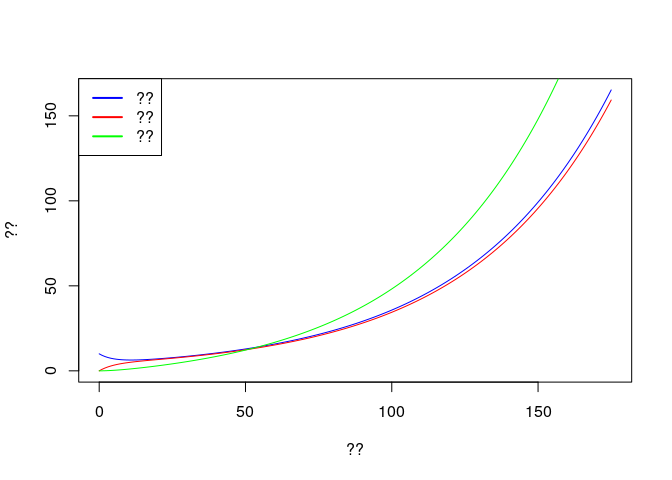
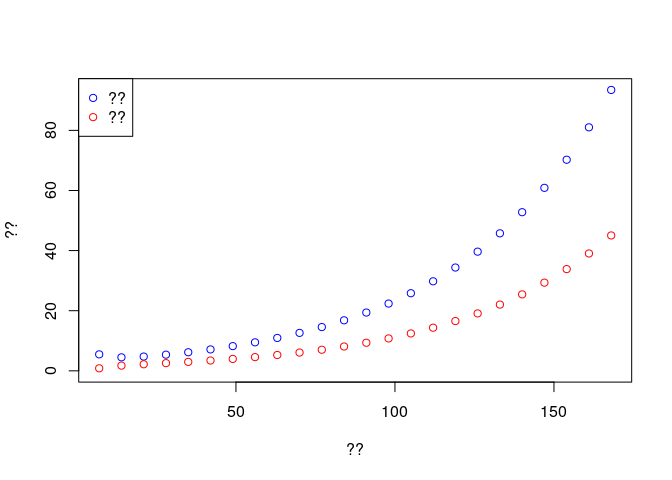
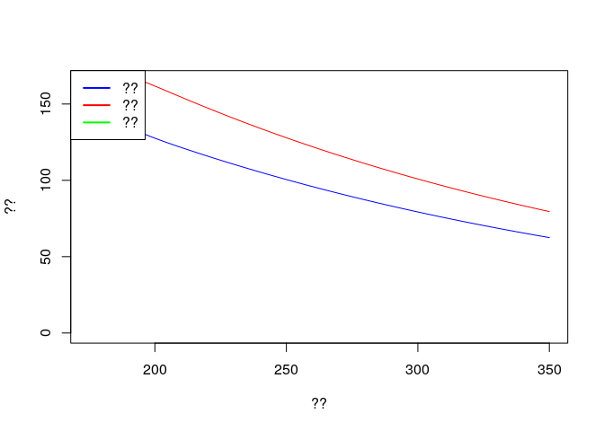
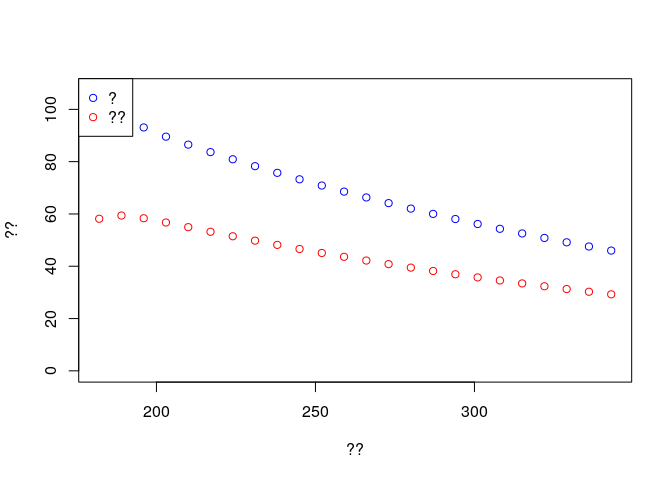
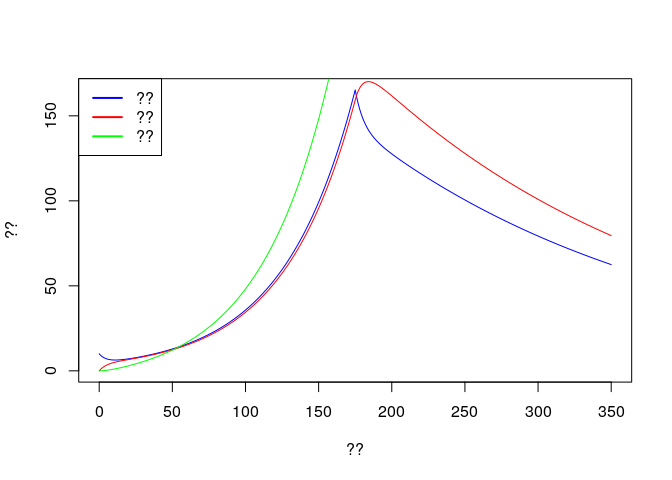
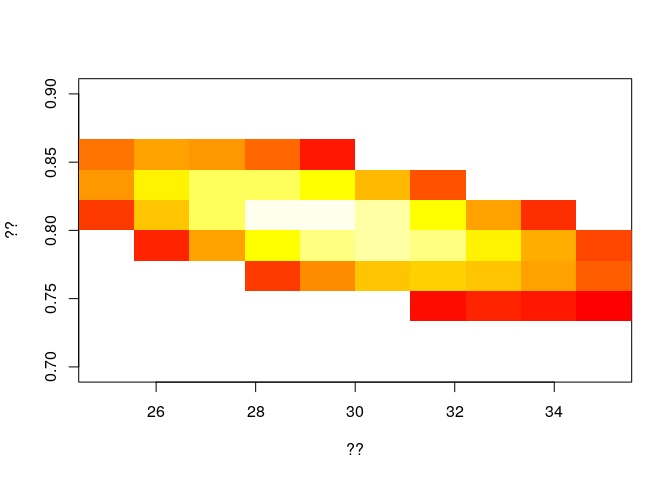
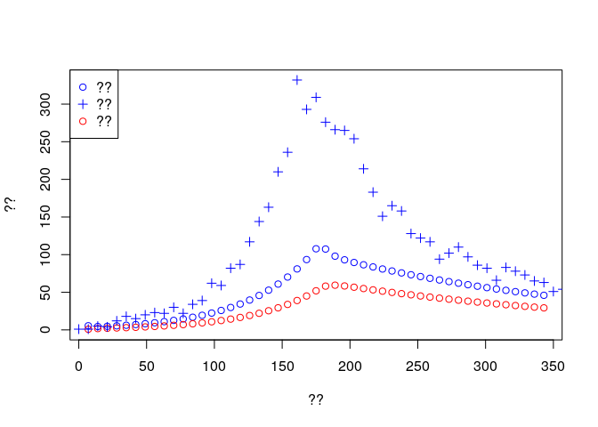
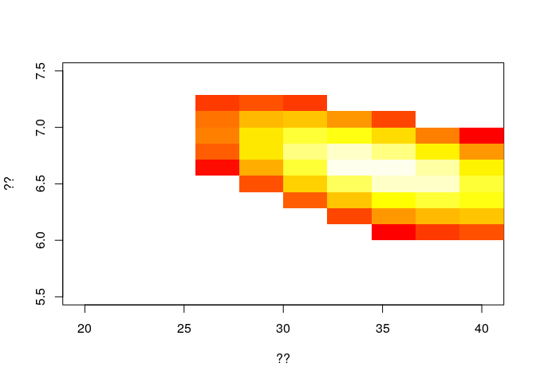
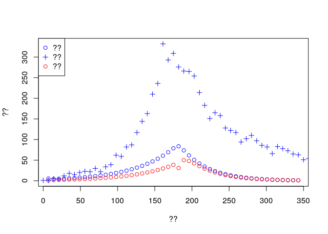

This practical aims to illustrate the basics of **Ebola modelling**
using R, with an emphasis on how the method works.

We will start with a basic model for Ebola. We will then illustrate how
to account for an evolving context, e.g. implementation of control
measures. Finally, we will explore basic principle of model fitting.

# Core Concepts

From the previous lecture, we will further develop these concepts:

  - Compartmental models
  - Flow diagrams and writing down a model
  - Natural history of Ebola
  - Control strategies
  - Introduction to model fitting

## Required packages

``` r
install.packages("deSolve", dep=TRUE)
install.packages("gridExtra", dep = TRUE)
```

Then load the packages using:

``` r
library(deSolve)
```

# The basic Ebola model

  - S : Susceptible humans
  - E : Exposed humans
  - I : Infected/Infectious humans
  - R : humans recovered from infection (with life lasting immunity)

## The model

The code below will allow you to simulate an Ebola outbreak. But, can
you understand it?

First make a flow diagram to connect the different compartments of the
model according to the equation below.

On a line of code, anything after a ‘\#’ is interpreted as a comment. At
the moment the code below is not well commented on, try to comment the
code appropriately.

``` r
rm(list=ls())

Dyn.Ebola.Basic <- function (t, state, parameters) {
   
  
   with(as.list(c(state,parameters)),             # ??
        {
          N <- S + E + I + R                      # ??
          # ??
          dS  <-  - S/N * beta * I                # ??
          dE <- S/N * beta * I - gamma * E        # ??
          dI <- gamma * E - sigma * I             # ??
          
          dR <- (1 - p.cfr) * sigma * I           # ??
          
          dDead <- p.cfr * sigma * I              # ??
          dOnset <- gamma * E                     # ??
          
          # ??
          dx <- c(dS, dE, dI, dR, dDead, dOnset)
          list(dx)
        }
   )
}
```

Then write the down the equation that characterize this particular
model:

<!-- $$\ \frac{dS}{dt}  = - \beta \frac {S_t I_t}{N_t} $$ -->

<!-- $$\ \frac{dE}{dt}  =  \beta \frac {S_t I_t}{N_t} - \sigma E_t $$ -->

<!-- $$\ \frac{dI}{dt}  =  \sigma E_t + \gamma I_t  $$ -->

<!-- $$\ \frac{dR}{dt}  =  (1-\mu) \gamma I_t  $$ -->

### The parameters

``` r
# ??
T.lat   <- 10                   #   ??
gamma <- 1/T.lat            #   ??

T.outcome <- 12             # ??
sigma <- 1/T.outcome        # ??

p.cfr   <-  0.6                 #   ??

R0 <- 1.5                   #   ??
R.int <- 0.9                # ??

t.intervention = 25*7       # ??

# ??
N <- 5e+5                   # ??
E0 <- 10                    # ??
```

Knowing the rate of transmission is typically very difficult without
detailed studies. However, measurig the reproduction number may be
easier.

From knowledge of the reproduction number, we can work out what is the
rate of transmission (\(\beta\)).

In this simple model, we have \[R_0 = \frac{\beta}{\gamma} \]. So given
the value for \(R_0\) above, what is the transmission rate?

<!-- $\beta = R_0* \gamma$. -->

### Numerically solve the system

We then need to solve the system numerically, i.e. using parameters
values and starting conditions, we can predict the trajectories of each
compartment over time.

The code below does that. Try to understand what is being done and
comment the code appropriately.

``` r

params <- c(gamma=gamma, sigma=sigma,
            p.cfr=p.cfr, beta=R0/T.outcome )   # ??


times  = seq(0, t.intervention, by=1)          # ??

# ??
xstart <- c(S = N-E0,E = E0,  
            I = 0, R = 0,
            Dead = 0, Onset = 0)               # ??

out <- as.data.frame(ode(y = xstart, times = times, 
                         func = Dyn.Ebola.Basic, parms = params))   # ??
```

### Plot some results

Can you interpret what is inside the dataframe ‘out’. you can view the
dataframe by typing ‘View(out)’

The code below allow to visualise some key results.

Fill the axis and legend for the plots and comment the code. Interpret
the results? <!-- Concept of exponential growth. -->

``` r

# ??
plot(out$time, out$E, col='blue',type='l',ylim = c(0,max(out$E)),
     xlab ='??', ylab = '??')
lines(out$time, out$I, col='red')
lines(out$time, out$R, col='green')

legend('topleft',c('??','??','??'),lwd=2,col=c('blue','red','green'))
```

<!-- -->

``` r

# ??
f <- seq(1,t.intervention,by=7)
time <- out$time[f]                # ??
Weekly.onset <- diff(out$Onset[f])  # ??
Weekly.death <- diff(out$Dead[f])   # ??

plot(time[-1], Weekly.onset, col='blue',type='p', ylim = c(0,max(Weekly.onset)),
     xlab ='??', ylab = '??')
lines(time[-1], Weekly.death,type='p',col='red')

legend('topleft',c('??','??'),pch=1,col=c('blue','red'))
```

<!-- -->

Fill the axis and legend for the plot. Interpret the results? Concept of
exponential growth.

### Change the transmissibility

Now we want to simulate a change in transmissibility linked to an
intervention.

Compare to the code above, what is changed in the code below?

Try to understand what is being done and comment the code appropriately.

``` r
# Simulation 2

params2 <- c(gamma=gamma, sigma=sigma,
             p.cfr=p.cfr, beta=R.int/T.outcome) # ??


times2  = seq(t.intervention, 2*t.intervention, by=1)
# Starting conditions
xstart2 <- c(S = tail(out$S,1), E = tail(out$E,1),  
             I = tail(out$I,1), R = tail(out$R,1),
             Dead = tail(out$Dead,1), Onset = tail(out$Onset,1))  # ??


out2 <- as.data.frame(ode(y = xstart2, times = times2, 
                         func = Dyn.Ebola.Basic, parms = params2))  # ??
```

What is being done in the code
above?

<!-- 1- The reproduction number takes its second value, therefore the rate of transmission is decreased. -->

<!-- 2- The new initial conditions are set to the previous final state of the system. -->

<!-- 3- The model is then run. -->

Some results for the new output can be seen below. Try to comment the
code and fill in relevant information in the graphs.

``` r
# ??
plot(out2$time, out2$E, col='blue',type='l',ylim = c(0,max(out$E)),
     xlab ='??', ylab = '??')
lines(out2$time, out2$I, col='red')
lines(out2$time, out2$R, col='green')

legend('topleft',c('??','??','??'),lwd=2,col=c('blue','red','green'))
```

<!-- -->

``` r

# ??
f <- seq(1,t.intervention,by=7)
time <- out2$time[f]
Weekly.onset <- diff(out2$Onset[f])
Weekly.death <- diff(out2$Dead[f])

plot(time[-1], Weekly.onset, col='blue',type='p', ylim = c(0,max(Weekly.onset)),
     xlab ='??', ylab = '??')
lines(time[-1], Weekly.death,type='p',col='red')

legend('topleft',c('?','??'),pch=1,col=c('blue','red'))
```

<!-- -->

### Merging both situations

Can we plot both trajectory? Pre- and post-intervention? see below. Try
to comment the code and fill in relevant information in the graphs.

``` r

## check full dynamics
# Checking the simulations
out3 <- rbind(out,out2[-1,])

plot(out3$time, out3$E, col='blue',type='l',ylim = c(0,max(out$E)),
     xlab ='??', ylab = '??')
lines(out3$time, out3$I, col='red')
lines(out3$time, out3$R, col='green')

legend('topleft',c('??','??','??'),lwd=2,col=c('blue','red','green'))
```

<!-- -->

``` r

# ??
f <- seq(1,2*t.intervention,by=7)
time <- out3$time[f]
Weekly.onset <- diff(out3$Onset[f])
Weekly.death <- diff(out3$Dead[f])

plot(time[-1], Weekly.onset, col='blue',type='p', ylim = c(0,max(Weekly.onset)),
     xlab ='??', ylab = '??')
lines(time[-1], Weekly.death,type='p',col='red')

legend('topleft',c('??','??'),pch=c(1,1),col=c('blue','red'))
```

<!-- -->

# Second model

We aim to reproduce the results above by calling the numerical solver
only once. We also would like to compare our results to data.

Comment an interpret the code below:

What changed compared to the code used above?

First, we write a new model that will be able to account for changes in
transmissibility.

Try to understand what is being done and comment the code appropriately.

``` r

Dyn.Ebola.Basic2 <- function (t, state, parameters) {
  
   with(as.list(c(state,parameters)), #??
        {
          N <- S + E + I + R  # ??
          
          beta <- ReproNb*sigma  # ??
         
          # ??
          dS  <-  - S/N * beta * I                # ??
          dE <- S/N * beta * I - gamma * E        # ??
          dI <- gamma * E - sigma * I             # ??
          
          dR <- (1 - p.cfr) * sigma * I           # ??
          
          dDead <- p.cfr * sigma * I              # ??
          dOnset <- gamma * E                     # ??
          
          dReproNb <- 0                           # ??
          
          # ??
          dx <- c(dS, dE, dI, dR, dDead, dOnset, dReproNb )
          list(dx)
        }
   )
}
```

### Initial conditions

Then we set initial conditions and time varying parameters.

Try to understand what is being done and comment the code appropriately.

``` r

times  = seq(0, 2 * t.intervention, by=1)          # ??
# ??
xstart <- c(S = N-E0,E = E0,  
            I = 0, R = 0,
            Dead = 0, Onset = 0, ReproNb = R0)               # ??

# ??
eventdat <- data.frame(var = "ReproNb", time = t.intervention,
                       value = R.int, method = "rep")         # ??


out <- as.data.frame(ode(y = xstart, times = times, 
                         func = Dyn.Ebola.Basic2, parms = params,
                         events = list(data = eventdat)))   # ??
```

### Plotting results

Finally we check the results and compare with observed data.

First dowload the dataset:
[compartmental-ebola-pratical.csv](../../data/compartmental-ebola-pratical.csv).

Try to comment the code and fill in relevant information in the graphs.

``` r
# Checking the simulations
plot(out$time, out$E, col='blue',type='l',ylim = c(0,max(out$E)),
     xlab ='??', ylab = '??')
lines(out$time, out$I, col='red')
lines(out$time, out$R, col='green')

legend('topleft',c('??','??','??'),lwd=2,col=c('blue','red','green'))
```

<!-- -->

``` r

# ??
f <- seq(1,2*t.intervention,by=7)  # ??
time <- out$time[f]                # ??
Weekly.onset <- diff(out$Onset[f])  # ??
Weekly.death <- diff(out$Dead[f])   # ??
```

``` r
dat <- read.csv('onset_data.csv')
```

Once imported, the data should look like:

``` r


plot(time[-1], Weekly.onset, col='blue',type='p', ylim = c(0,max(dat$incidence)),
     xlab ='??', ylab = '??')
lines(time[-1], Weekly.death,type='p',col='red')

lines(dat$date, dat$incidence, type='p',pch=3, col='blue')

legend('topleft',c('??','??','??'),pch=c(1,3,1),col=c('blue','blue','red'))
```

<!-- -->

Now, try to modify:

  - the initial number in the exposed class, and

  - the reproduction post-intervention.

Re-run the model and observe the fit.

Try to obtain a better fit by changing paraemters.

### Exploration of fitting

Fitting manually to the data like above is tedious and not rigorous. We
can explore a simple statistical method.

Let’s assume that we want to fit the initial number in the exposed class
and the reproduction post-intervention. Clearly, we must find the values
for those parameters such that our predictions matched best the
observations.

Assuming that the incidence in a given week follows a Poisson
distribution with mean given by our prediction:
\[P(I^{obs}_t|\theta) \propto  Poiss(I^{pred}_t) \].

If each weekly incidences are assumed independent, the likelihood of the
model could be written as: \[ L=\Pi [P(I^{obs}_t|\theta)]  \].

in a very simple way, maximizing this likelihood will give us our best
parameters.

### In practice

Interpret and comment the code below and add information on the plot.

In particular, what lighter color on the heat-graph represents? You can
view the matrix L by typing ‘View(L)’ in the console.

``` r
E_ini <- seq(25,35,length=10)      # ??
R2 <- seq(.7,.9,length=10)         # ??
L <- matrix(NA,length(E_ini),length(R2))   # ??

for (i in 1:length(E_ini)){   # ??
  for (j in 1:length(R2)){    # ??
    xstart <- c(S = N-E_ini[i],E = E_ini[i],  
                I = 0, R = 0,
                Dead = 0, Onset = 0, ReproNb = R0)               # ??
    
    eventdat <- data.frame(var = "ReproNb", time = t.intervention,
                           value = R2[j], method = "rep")          # ??
  
    out <- as.data.frame(ode(y = xstart, times = times, 
                             func = Dyn.Ebola.Basic2, parms = params,
                             events = list(data = eventdat)))   # ??
    
    Weekly.onset <- diff(out$Onset[f]) # ??
    
    L[i,j] <- sum(dpois(x = dat$incidence,lambda = Weekly.onset,log = TRUE))  # ??
    
  }
}
L[L < (max(L)*1.2)] <- NA          # ??
image(E_ini,R2,L, col = heat.colors(30), xlab = '??', ylab = '??')  # ??
```

<!-- -->

Now, from visual inspection of the graph, you can choose your best fit
values for:

  - the initial number in the exposed class, and

  - the reproduction post-intervention,

### Plot the final fit

Then, we want to plot the observed versus the new predicted data.

Fill in the missing bits to be able to run the code below.

Try to understand and comment the code below:

``` r
# final 
xstart <- c(S = N-E_ini[i],E = 10,  
            I = 0, R = 0,
            Dead = 0, Onset = 0, ReproNb = 1.5)               # ??

eventdat <- data.frame(var = "ReproNb", time = t.intervention,
                       value = .9, method = "rep")               # ??

out <- as.data.frame(ode(y = xstart, times = times, 
                         func = Dyn.Ebola.Basic2, parms = params,
                         events = list(data = eventdat)))   # ??

# ??
f <- seq(1,2*t.intervention,by=7)  # ??
time <- out$time[f]                # ??
Weekly.onset <- diff(out$Onset[f])  # ??
Weekly.death <- diff(out$Dead[f])   # ??


# plot
plot(time[-1], Weekly.onset, col='blue',type='p', ylim = c(0,max(dat$incidence)),
     xlab ='??', ylab = '??')
lines(time[-1], Weekly.death,type='p',col='red')

lines(dat$date, dat$incidence, type='p',pch=3, col='blue')

legend('topleft',c('??','??','??'),pch=c(1,3,1),col=c('blue','blue','red'))
```

<!-- -->

# Final model

In the previous model, the intervention was modelled as a change in the
reproduction number. Often it is useful to know more specifically what
changed, i.e. this is the main advantage in building a ‘mechanistic
model’.

For instance, if you know that isolated cases are not transmitting
further, then an increase in ‘early’ isolation may help control the
disease. A model can help quantify this and gain better intuition.

Retrospectively, if we know that such an intervention was implemented,
then we can better understand to which extent it decreased transmission.

For instance we may know that the time to isolation decreased from
**11.5 days** pre-intervention to a lower value, but we are unsure by
how much.

See the code below can you interpret it?

First we write a new model:

``` r

Dyn.Ebola.Basic3 <- function (t, state, parameters) {
   
   with(as.list(c(state,parameters)), # ??
        {
          N <- S + E + I + R  # ??
          # ??
          sigma.h <- 1/delay_hosp                       # ??
          sigma <- 1/(delay_onset_outcome-delay_hosp)   # ??
          
          
          dS  <-  - S/N * beta * I                # ??
          dE <- S/N * beta * I - gamma * E        # ??
          dI <- gamma * E - sigma.h * I           # ??
          dIh <- sigma.h * I - sigma * Ih         # ??
          
          dR <- (1 - p.cfr) * sigma * Ih           # ??
          
          dDead <- p.cfr * sigma * Ih              # ??
          dOnset <- gamma * E                     # ??
          
          ddelay_hosp <- 0                           # ??
          
          # ??
          dx <- c(dS, dE, dI, dIh, dR, dDead, dOnset, ddelay_hosp )
          list(dx)
        }
   )
}
```

As before, try to:

  - understand the code and comment it,

  - draw a flow diagram,

\-write dow the new equations of the system.

### New parameters

This should be very familiar, but comment on the code to make sure you
understand everything.

``` r
#==================  Parameters 

T.lat   <- 10                   #   ??
gamma <- 1/T.lat            #   ??

T.outcome <- 12             # ??
T.hosp.1 <- 11.5            # ??
T.hosp.2 <- 5                # ??

p.cfr   <-  0.6                 #   ??

R0 <- 1.5                   #   ??

# ??
N <- 5e+5                   # ??
E0 <- 10                     # ??

# ??
t.intervention = 25*7      # ??
```

### Numerically solve the model

Then as before we run the model.

Again make sure you understand everything and comment the code.

What is being change post-intervention?

``` r
#================== Simulation 1

params <- c(gamma=gamma, delay_hosp = T.hosp.1, delay_onset_outcome = T.outcome,
            beta = R0/T.outcome,
            p.cfr=p.cfr )   # ??


times  = seq(0, 2 * t.intervention, by=1)          # ??
# ??
xstart <- c(S = N-E0,E = E0,  
            I = 0, Ih = 0, R = 0,
            Dead = 0, Onset = 0, delay_hosp = T.hosp.1)               # ??

# ??
eventdat <- data.frame(var = "delay_hosp", time = t.intervention,
                       value = T.hosp.2, method = "rep")


out <- as.data.frame(ode(y = xstart, times = times, 
                         func = Dyn.Ebola.Basic3, parms = params,
                         events = list(data = eventdat)))   # ??
```

### Plotting results

Check the results by running the code below.

Fill in the comment and complete the graph information

``` r
# Checking the simulations
plot(out$time, out$E, col='blue',type='l',ylim = c(0,max(out$E)),
     xlab ='??', ylab = '??')
lines(out$time, out$I, col='red')
lines(out$time, out$R, col='green')

legend('topleft',c('??','??','??'),lwd=2,col=c('blue','red','green'))
```

<!-- -->

``` r

# ??
f <- seq(1,2*t.intervention,by=7)
time <- out$time[f]
Weekly.onset <- diff(out$Onset[f])
Weekly.death <- diff(out$Dead[f])


plot(time[-1], Weekly.onset, col='blue',type='p', ylim = c(0,max(dat$incidence)),
     xlab ='??', ylab = '??')
lines(time[-1], Weekly.death,type='p',col='red')

lines(dat$date, dat$incidence, type='p',pch=3, col='blue')

legend('topleft',c('??','??','??'),pch=c(1,3,1),col=c('blue','blue','red'))
```

<!-- -->

As before, try to modify:

  - the initial number in the exposed class, and

  - the time to hospitalisation post-intervention.

Re-run the model and observe the fit.

Your aim here is to fit the data better, and estimate by how much the
time to isolation decreased after the intervention.

### Fitting

As before, fitting the model manually is not ideal.

Try to run the code below. Again, fill in the missing bits and interpret
the code:

``` r
###########################################################
#### get likelihood  ######################################
###########################################################

E_ini <- seq(20,40,length=10)  # ??
T2 <- seq(5.5,7.5,length=15) # ??
L <- matrix(NA,length(E_ini),length(T2)) # ??

for (i in 1:length(E_ini)){
  for (j in 1:length(T2)){
    xstart <- c(S = N-E_ini[i],E = E_ini[i],  
                I = 0, Ih = 0, R = 0,
                Dead = 0, Onset = 0, delay_hosp = T.hosp.1)               # ??
    
    eventdat <- data.frame(var = "delay_hosp", time = t.intervention,
                          value = T2[j], method = "rep")     # ??
  
    out <- as.data.frame(ode(y = xstart, times = times, 
                             func = Dyn.Ebola.Basic3, parms = params,
                             events = list(data = eventdat)))   # ??
    
    Weekly.onset <- diff(out$Onset[f]) # ??
    
    L[i,j] <- sum(dpois(x = dat$incidence,lambda = Weekly.onset,log = TRUE))  # ??
    
  }
}
L[L < (max(L)*1.5)] <- NA
image(E_ini,T2,L, col = heat.colors(30),xlab = '??', ylab='??')
```

<!-- -->

We obtain best fit measure for the new time to hospitalisation.

### Final fit

Now fill in the code below to be able to run it and observe your new
fit.

``` r

# final 
xstart <- c(S = N-E_ini[i],E = 10,  
            I = 0, Ih = 0, R = 0,
            Dead = 0, Onset = 0, delay_hosp = T.hosp.1)               # ??

eventdat <- data.frame(var = "delay_hosp", time = t.intervention,
                       value = 5, method = "rep")

out <- as.data.frame(ode(y = xstart, times = times, 
                         func = Dyn.Ebola.Basic3, parms = params,
                         events = list(data = eventdat)))   # ??

# weekly incidence and weekly number of death
f <- seq(1,2*t.intervention,by=7)
time <- out$time[f]
Weekly.onset <- diff(out$Onset[f])
Weekly.death <- diff(out$Dead[f])

# plot
plot(time[-1], Weekly.onset, col='blue',type='p', ylim = c(0,max(dat$incidence)),
     xlab ='??', ylab = '??')
lines(time[-1], Weekly.death,type='p',col='red')

lines(dat$date, dat$incidence, type='p',pch=3, col='blue')

legend('topleft',c('??','??','??'),pch=c(1,3,1),col=c('blue','blue','red'))
```

<!-- -->

### Explore further

you can explore further:

  - try compute the full outbreak size,

  - how many live could you save by intervening earlier (perhaps draw
    graph)?

  - what is the influence of T.Hosp.2 on final size?

# About this document

## Contributors

  - Pierre Nouvellet & Zulma Cucunuba: initial version

## Legal stuff

**License**: [CC-BY](https://creativecommons.org/licenses/by/3.0/)
**Copyright**: Pierre Nouvellet & Zulma Cucunuba, 2017
